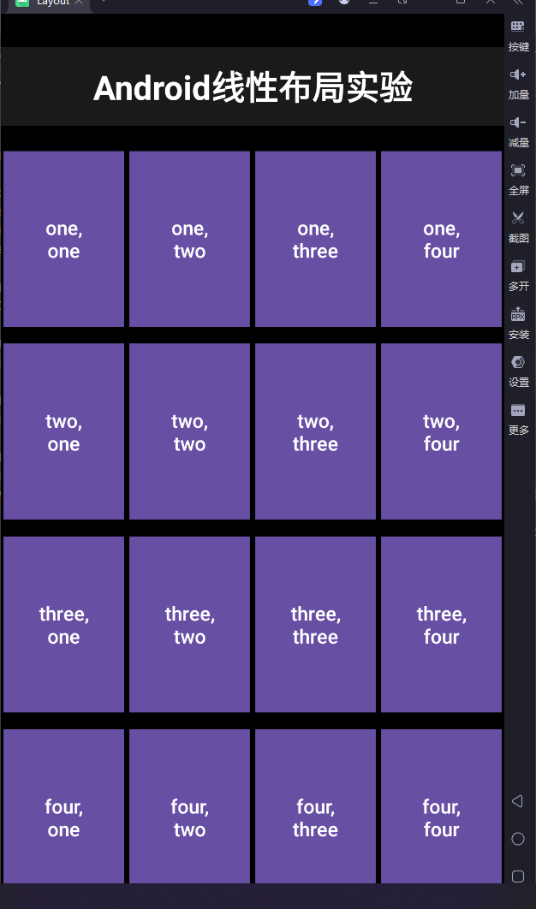
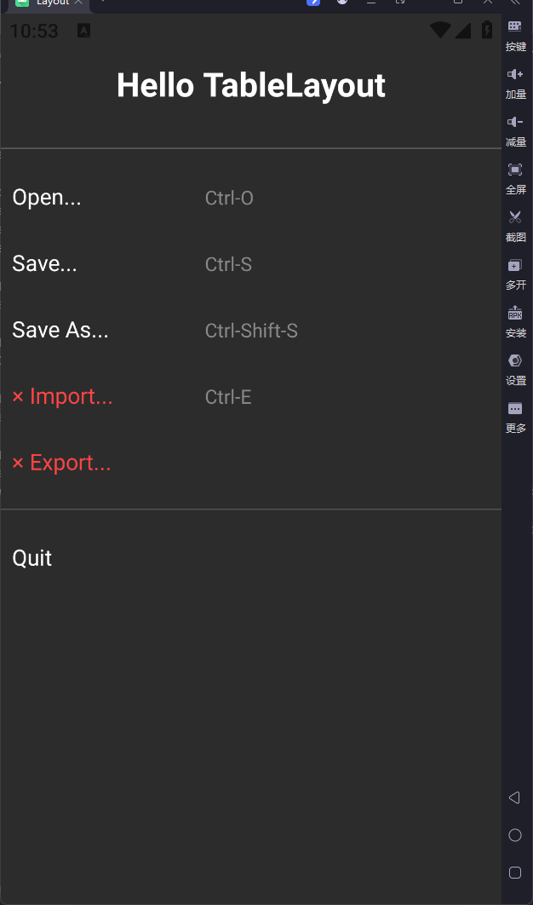
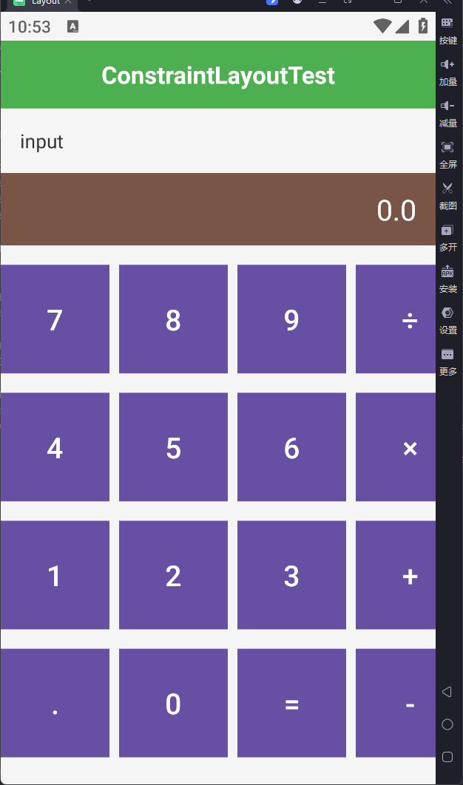
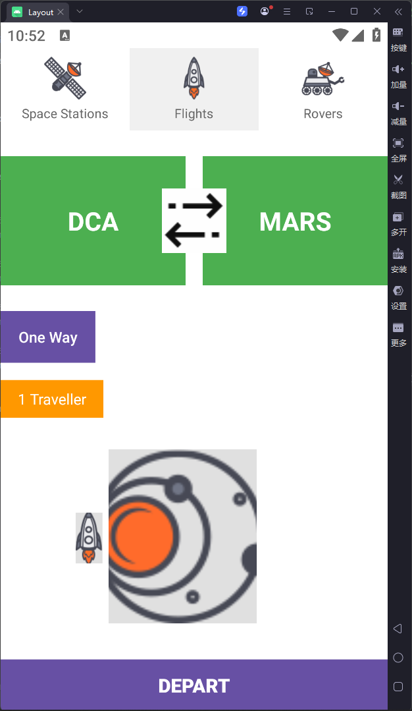

# Android布局实验项目

本项目展示了Android开发中常用的几种布局方式，包括线性布局、表格布局和约束布局。通过这个项目，你可以学习和比较不同布局方式的特点和使用场景。

## 项目结构

```
app/src/main/res/layout/
├── activity_main.xml      # 默认布局
├── linear_layout.xml      # 线性布局示例
├── table_layout.xml       # 表格布局示例
├── constraintlayout1.xml  # 约束布局示例1（计算器）
└── constraintlayout2.xml  # 约束布局示例2（太空旅行）
```

## 布局说明

### 1. 线性布局 (linear_layout.xml)
- 展示了垂直和水平线性布局的嵌套使用
- 包含多行多列的按钮网格
- 使用了layout_weight属性实现等比例分配空间

### 2. 表格布局 (table_layout.xml)
- 模拟了带有快捷键提示的菜单界面
- 使用TableRow组织内容
- 包含标题、分隔线和菜单项

### 3. 约束布局1 (constraintlayout1.xml)
- 实现了一个计算器界面
- 展示了复杂的约束关系
- 使用了constraintDimensionRatio实现正方形按钮
- 使用了constraintWidth_percent控制按钮宽度

### 4. 约束布局2 (constraintlayout2.xml)
- 实现了一个太空旅行主题的界面
- 包含图片、按钮和文本元素
- 展示了约束布局的灵活定位能力

## 如何切换布局

在`MainActivity.java`文件中，通过注释和取消注释不同的`setContentView()`方法来切换布局：

### MainActivity.java 核心代码

```java
package com.example.layout;

import android.os.Bundle;
import androidx.activity.EdgeToEdge;
import androidx.appcompat.app.AppCompatActivity;
import androidx.core.graphics.Insets;
import androidx.core.view.ViewCompat;
import androidx.core.view.WindowInsetsCompat;

public class MainActivity extends AppCompatActivity {

    @Override
    protected void onCreate(Bundle savedInstanceState) {
        super.onCreate(savedInstanceState);
        EdgeToEdge.enable(this);

        // 使用线性布局文件
        //setContentView(R.layout.linear_layout);

        // 使用表格布局文件
        //setContentView(R.layout.table_layout);

        // 使用约束布局1文件
        //setContentView(R.layout.constraintlayout1);

        // 使用约束布局2文件
        setContentView(R.layout.constraintlayout2);
        ViewCompat.setOnApplyWindowInsetsListener(findViewById(R.id.main), (v, insets) -> {
            Insets systemBars = insets.getInsets(WindowInsetsCompat.Type.systemBars());
            v.setPadding(systemBars.left, systemBars.top, systemBars.right, systemBars.bottom);
            return insets;
        });
    }
}
```

### 线性布局核心代码

```xml
<!-- 线性布局示例核心代码 -->
<LinearLayout
    android:layout_width="match_parent"
    android:layout_height="match_parent"
    android:orientation="vertical"
    android:padding="16dp"
    android:background="#000000">
    
    <!-- 第一行 -->
    <LinearLayout
        android:layout_width="match_parent"
        android:layout_height="0dp"
        android:layout_weight="1"
        android:orientation="horizontal"
        android:layout_marginBottom="8dp">
        
        <Button
            android:layout_width="0dp"
            android:layout_height="match_parent"
            android:layout_weight="1"
            android:text="one, one"
            android:textAllCaps="false" />
        
        <!-- 更多按钮... -->
    </LinearLayout>
    
    <!-- 更多行... -->
</LinearLayout>
```

### 表格布局核心代码

```xml
<!-- 表格布局示例核心代码 -->
<TableLayout
    android:layout_width="match_parent"
    android:layout_height="match_parent"
    android:background="#2C2C2C"
    android:padding="20dp"
    android:stretchColumns="*">
    
    <!-- 标题行 -->
    <TableRow>
        <TextView
            android:text="Hello TableLayout"
            android:textSize="24sp"
            android:textStyle="bold"
            android:layout_span="2" />
    </TableRow>
    
    <!-- 菜单项 -->
    <TableRow>
        <TextView
            android:text="Open..."
            android:layout_weight="1" />
        <TextView
            android:text="Ctrl-O" />
    </TableRow>
    
    <!-- 更多菜单项... -->
</TableLayout>
```

### 约束布局核心代码

```xml
<!-- 约束布局示例核心代码 -->
<androidx.constraintlayout.widget.ConstraintLayout
    android:layout_width="match_parent"
    android:layout_height="match_parent"
    android:background="#F5F5F5">
    
    <!-- 计算器结果显示 -->
    <TextView
        android:id="@+id/resultDisplay"
        android:layout_width="0dp"
        android:layout_height="60dp"
        android:background="#795548"
        android:text="0.0"
        android:textSize="24sp"
        android:textColor="#FFFFFF"
        android:gravity="right|center_vertical"
        app:layout_constraintStart_toStartOf="parent"
        app:layout_constraintEnd_toEndOf="parent"
        app:layout_constraintTop_toTopOf="parent" />
    
    <!-- 计算器按钮 -->
    <Button
        android:id="@+id/btn7"
        android:layout_width="0dp"
        android:layout_height="0dp"
        android:text="7"
        android:textSize="24sp"
        app:layout_constraintTop_toBottomOf="@id/resultDisplay"
        app:layout_constraintStart_toStartOf="parent"
        app:layout_constraintEnd_toStartOf="@id/btn8"
        app:layout_constraintWidth_percent="0.25"
        app:layout_constraintDimensionRatio="1:1" />
    
    <!-- 更多按钮... -->
</androidx.constraintlayout.widget.ConstraintLayout>
```

## 技术栈

- Android Studio
- Java
- XML

## 截图

### 线性布局



### 表格布局



### 约束布局1（计算器）



### 约束布局2（太空旅行）



## 如何运行

1. 克隆或下载项目到本地
2. 使用Android Studio打开项目
3. 连接Android设备或启动模拟器
4. 运行项目
5. 在`MainActivity.java`中切换不同的布局，重新运行查看效果
