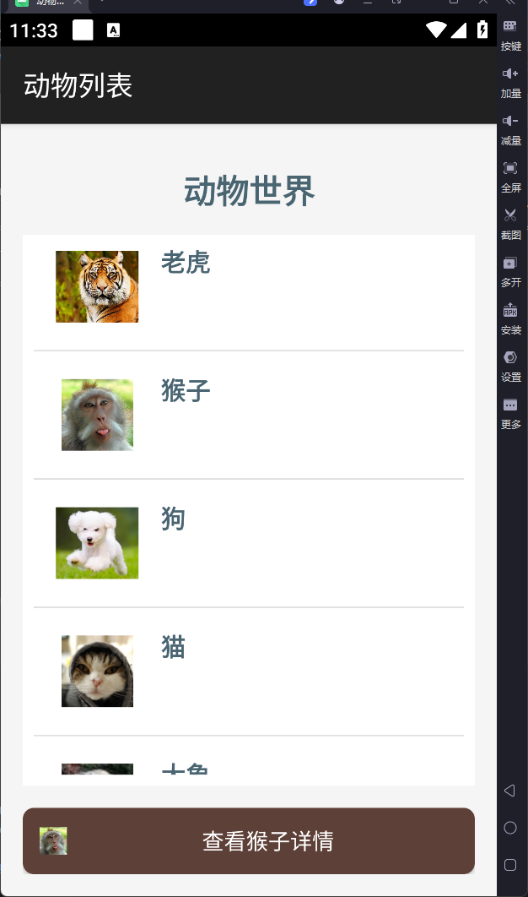

# Android ListViews 示例项目

这是一个Android ListViews示例项目，包含多个功能模块，展示了Android开发中的各种技术和组件使用。

## 功能模块

### 1. 动物列表（AnimalListActivity）
- 展示动物列表，包含动物名称和图片
- 点击列表项可以选择动物，显示详情按钮
- 点击详情按钮可以查看动物详情并发送通知

### 2. 自定义AlertDialog（CustomDialogActivity）
- 展示自定义登录对话框
- 包含用户名和密码输入框
- 支持取消和登录操作
- 有简单的输入验证

### 3. ActionMode上下文菜单（ActionModeActivity）
- 展示列表项的多选功能
- 长按列表项可以进入选择模式
- 支持批量删除选中项

### 4. 使用XML定义菜单（XmlMenuActivity）
- 展示使用XML定义的选项菜单
- 支持字体大小调整（小、中、大）
- 支持字体颜色调整（红色、黑色）
- 包含普通菜单项，点击弹出Toast提示

## 截图展示

### 动物列表


### 自定义AlertDialog


### 使用XML定义菜单


## 关键代码

### 1. 动物列表 - 列表项点击事件
```java
// 列表项点击事件
alanimalListView.setOnItemClickListener(new AdapterView.OnItemClickListener() {
    @Override
    public void onItemClick(AdapterView<?> parent, View view, int position, long id) {
        // 更新选中的动物索引
        selectedAnimalIndex = position;
        
        // 显示点击响应
        String message = "你点击了" + animalNames[position] + "动物";
        Toast.makeText(AnimalListActivity.this, message, Toast.LENGTH_SHORT).show();
        
        // 更新按钮显示
        updateAnimalButton();
        
        // 显示按钮
        animalButton.setVisibility(View.VISIBLE);
    }
});
```

### 2. 自定义AlertDialog - 显示对话框
```java
private void showCustomAlertDialog() {
    // 创建AlertDialog.Builder对象
    AlertDialog.Builder builder = new AlertDialog.Builder(this);
    
    // 设置对话框标题
    builder.setTitle("Android App");
    
    // 加载自定义布局
    LayoutInflater inflater = getLayoutInflater();
    View dialogView = inflater.inflate(R.layout.dialog_custom, null);
    
    // 获取自定义布局中的控件
    final EditText etUsername = dialogView.findViewById(R.id.etUsername);
    final EditText etPassword = dialogView.findViewById(R.id.etPassword);
    Button btnCancel = dialogView.findViewById(R.id.btnCancel);
    Button btnSignIn = dialogView.findViewById(R.id.btnSignIn);
    
    // 设置View
    builder.setView(dialogView);
    
    // 创建并显示对话框
    final AlertDialog dialog = builder.create();
    dialog.show();
    
    // 设置按钮点击事件
    // ...
}
```

### 3. 使用XML定义菜单 - 菜单处理
```java
@Override
public boolean onOptionsItemSelected(MenuItem item) {
    int id = item.getItemId();
    
    if (id == R.id.menu_font_small) {
        menuText.setTextSize(10);
        return true;
    } else if (id == R.id.menu_font_medium) {
        menuText.setTextSize(16);
        return true;
    } else if (id == R.id.menu_font_large) {
        menuText.setTextSize(20);
        return true;
    } else if (id == R.id.menu_normal) {
        Toast.makeText(this, "普通菜单项被点击", Toast.LENGTH_SHORT).show();
        return true;
    } else if (id == R.id.menu_color_red) {
        menuText.setTextColor(ContextCompat.getColor(this, R.color.red));
        return true;
    } else if (id == R.id.menu_color_black) {
        menuText.setTextColor(ContextCompat.getColor(this, R.color.black));
        return true;
    } else {
        return super.onOptionsItemSelected(item);
    }
}
```

## 技术栈

- Java
- Android SDK
- Android Studio
- Gradle

## 项目结构

```
Listviews/
├── app/
│   ├── src/
│   │   ├── main/
│   │   │   ├── java/com/example/listviews/
│   │   │   │   ├── AnimalListActivity.java
│   │   │   │   ├── CustomDialogActivity.java
│   │   │   │   ├── ActionModeActivity.java
│   │   │   │   └── XmlMenuActivity.java
│   │   │   ├── res/
│   │   │   │   ├── layout/
│   │   │   │   ├── menu/
│   │   │   │   ├── drawable/
│   │   │   │   └── values/
│   │   │   └── AndroidManifest.xml
│   └── build.gradle.kts
├── gradle/
├── screenshots/
└── README.md
```

## 如何使用

1. 克隆项目到本地
2. 使用Android Studio打开项目
3. 连接Android设备或启动模拟器
4. 运行项目
5. 在AndroidManifest.xml中可以切换不同的启动Activity

## 许可证

MIT License

## 贡献

欢迎提交Issue和Pull Request！
